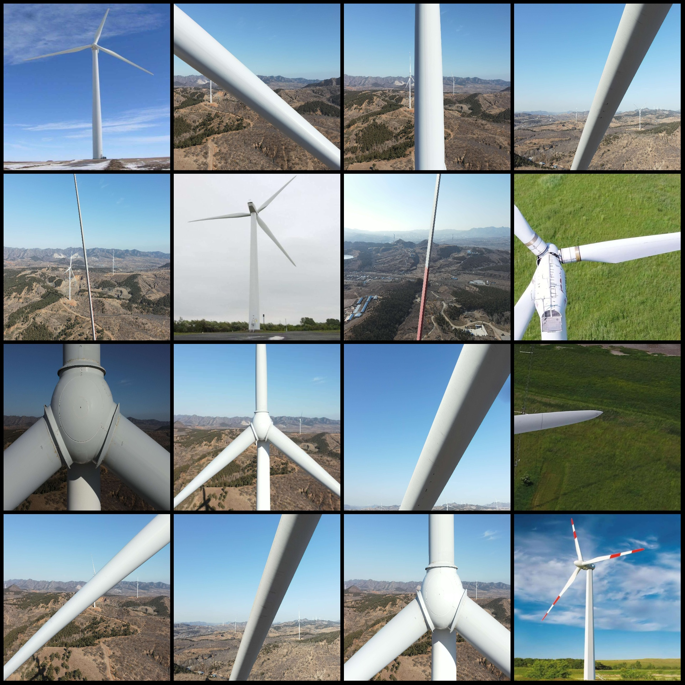
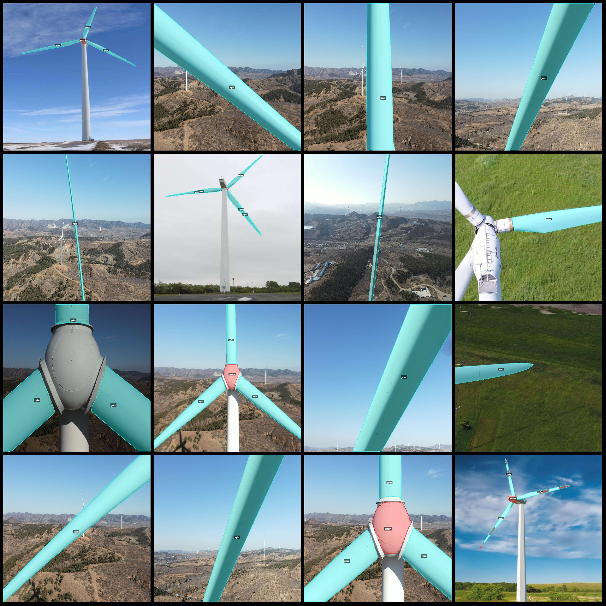
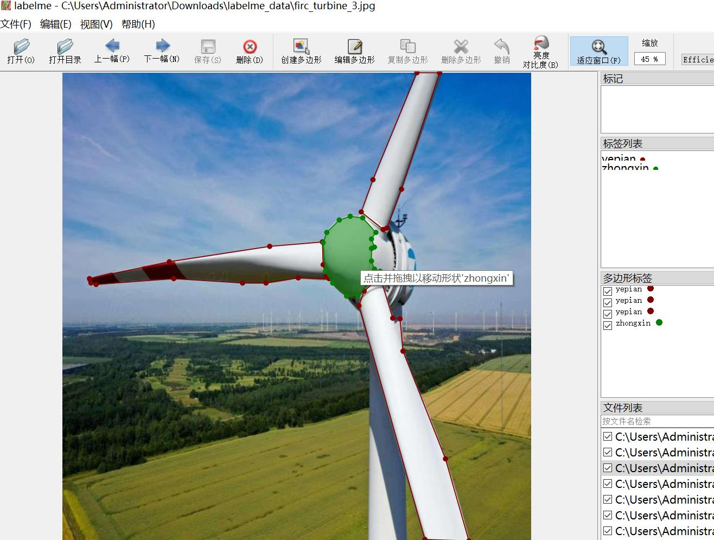

# Drone Perspective Intelligent Electric Power Wind Turbine Blades Center Segmentation Dataset in LabelMe Format with 798 Images and 2 Categories

Data set format: labelme format (without mask files, only including jpg images and corresponding json files)  
Number of images (number of jpg files): 798  
Number of annotations (json file count): 798  
Number of annotation categories: 2  
Annotation category names: ["yepian", "zhongxin"]  
Number of boxes for each category:  
yepian (blades) count = 1083  
zhongxin (center) count = 97  
Total number of boxes: 1180  
Annotation tool used: labelme = 5.5.0  
Image resolutions: various resolutions such as 1920x1920, 640x640, etc.  
Annotation rules: Polygon is drawn around the category.  
Important note: The dataset can be opened and edited using labelme, but the json dataset needs to be converted into either a mask or Yolo format or COCO format for semantic segmentation or instance 
segmentation.  
Special declaration: This dataset does not guarantee the accuracy of the trained models or weight files.  
Image previews:  
Annotation example:  
Randomly selected 16 images:  
Annotation drawing results:  
LabelMe editing image examples:

## Images

Here is a pay link on Stripe ( https://buy.stripe.com/3cs8yP7sY87d0vu9AB ). Please contact me lonlonago@foxmail.com after funding $89, and I will send you a complete data files , thank you!

